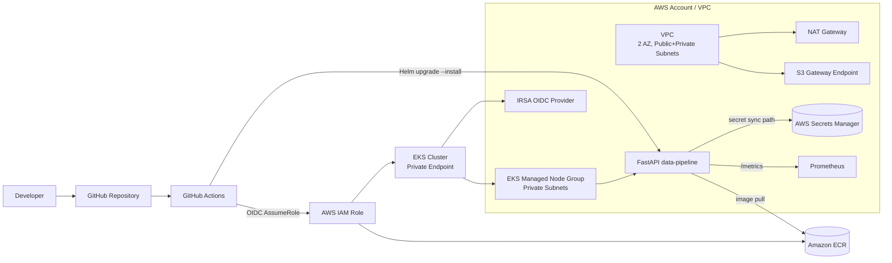

# accel

Production-grade, security-first platform and deployment system for a containerized data pipeline application on AWS (EKS + Terraform + Helm + GitHub Actions).

## Architecture



## Repository Layout

- `apps/data-pipeline`: FastAPI service, dependencies, Dockerfile.
- `infra/terraform/modules`: reusable Terraform modules (`network`, `eks`, `secrets-manager`, etc.).
- `infra/terraform/envs/prod`: production composition, variables, and outputs.
- `deploy/helm/data-pipeline`: app deployment chart, service, namespace, network policies.
- `deploy/observability/prometheus`: lightweight Prometheus values and SLI alert rules.
- `.github/workflows`: CI/CD workflows (build, scan, push, deploy).

## Prerequisites

- Terraform `>= 1.8`
- AWS CLI v2
- `kubectl`
- Helm v3
- Docker
- AWS account with permissions for VPC/EKS/ECR/Secrets Manager/IAM
- Remote Terraform backend prepared (S3 bucket + DynamoDB lock table)

## Setup Instructions

### 1) Configure Terraform backend and variables

From `infra/terraform/envs/prod`, create backend config file (example `backend.hcl`) and provide secret value securely.

Example backend file:

```hcl
bucket         = "your-terraform-state-bucket"
key            = "accel/prod/terraform.tfstate"
region         = "us-east-1"
dynamodb_table = "your-terraform-locks"
encrypt        = true
```

Set secret value out of band (recommended):

```bash
export TF_VAR_eks_deployment_secret_value='replace-with-real-secret'
```

### 2) Provision infrastructure (VPC + EKS + secret)

```bash
cd infra/terraform/envs/prod
terraform init -backend-config=backend.hcl
terraform fmt -check -recursive
terraform validate
terraform plan -var-file=prod.tfvars -out=tfplan
terraform apply tfplan
```

### 3) Build and run app locally (optional)

```bash
cd apps/data-pipeline
docker build -t data-pipeline:local .
docker run --rm -p 8000:8000 data-pipeline:local
```

Quick checks:

```bash
curl -s http://127.0.0.1:8000/healthz
curl -s -X POST http://127.0.0.1:8000/process -H 'content-type: application/json' -d '{"message":"hello"}'
curl -s http://127.0.0.1:8000/metrics | head
```

### 4) Configure GitHub Actions deployment

Set required GitHub configuration:

- Secret: `AWS_ROLE_ARN`
- Repository/org variables:
  - `AWS_REGION`
  - `ECR_REPOSITORY`
  - `EKS_CLUSTER_NAME`
  - `K8S_NAMESPACE`
  - `HELM_RELEASE_NAME`
  - `K8S_DEPLOYMENT_NAME`
  - `K8S_SERVICE_NAME`

Then push to `main` (or manually run workflow) to:

- build image
- run Trivy scan (fail on HIGH/CRITICAL)
- push to ECR
- deploy with Helm
- validate rollout
- rollback on failure
- run smoke test on `/healthz`

### 5) Deploy observability stack

```bash
kubectl create namespace observability --dry-run=client -o yaml | kubectl apply -f -
kubectl apply -f deploy/observability/prometheus/sli-alert-rules-configmap.yaml
helm repo add prometheus-community https://prometheus-community.github.io/helm-charts
helm upgrade --install prometheus prometheus-community/prometheus \
  -n observability \
  -f deploy/observability/prometheus/prometheus-values.yaml
```

## Security Notes

- EKS API endpoint is private-only by default.
- Workloads run as non-root and drop all Linux capabilities.
- NetworkPolicy is deny-by-default with explicit allow rules for app traffic, metrics scraping, and DNS egress.
- Secrets are not hardcoded in manifests; app consumes Kubernetes Secret references (expected sync from AWS Secrets Manager).
- CI uses OIDC and short-lived credentials (no static AWS keys).

## Operational Notes

- If EKS endpoint is private, GitHub-hosted runners usually cannot reach it; use a self-hosted runner with network path to the VPC.
- Alert rules assume app exposes:
  - `http_requests_total`
  - `http_request_duration_seconds_bucket`
